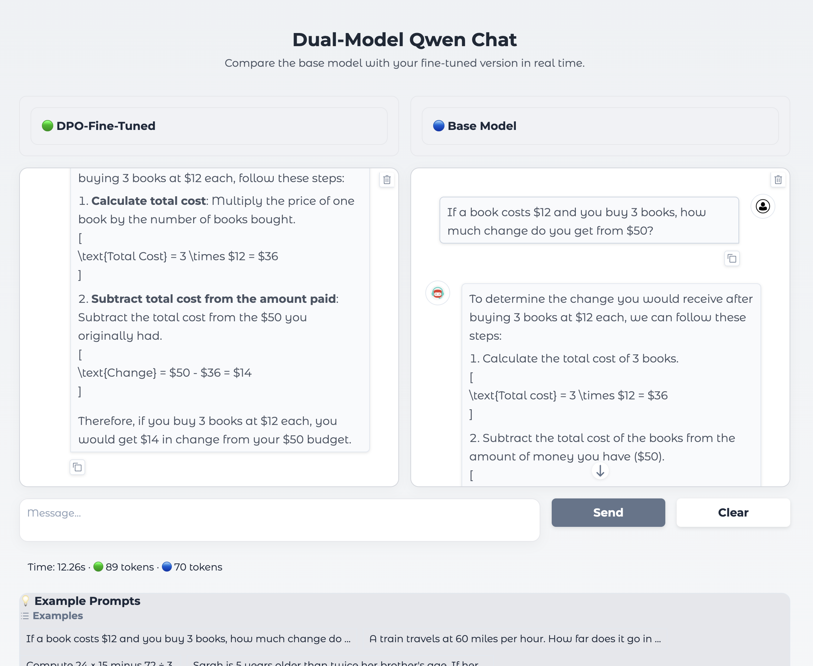

# LLM Fine-Tuning & RLHF on Qwen2.5-0.5B

This repository contains two educational notebooks showing how to adapt a small open LLM using:
1. **Supervised Fine-Tuning (SFT)** with LoRA and 4-bit quantization  
2. **RLHF-style optimization** using DPO / GRPO (preference-based methods)

The goal is to demonstrate a lightweight and reproducible pipeline to make an LLM follow instructions better, even on limited hardware (single GPU / Colab).

---

## 📘 Notebooks

- `notebooks/01_instruction_finetuning_qwen.ipynb`  
  Loads `Qwen/Qwen2.5-0.5B`, quantizes it to 4-bit, attaches LoRA adapters and fine-tunes it on the public `giuliadc/orangesum_5k` dataset (French summarization → instruction format).  
  Includes merging of LoRA weights and evaluation before/after fine-tuning.

- `notebooks/02_rlhf_dpo_grpo_qwen.ipynb`  
  Applies **Direct Preference Optimization (DPO)** and shows how to structure a **GRPO** experiment using the 🤗 TRL library.  
  The notebook is fully runnable without W&B and includes an optional Gradio interface for testing.

---

## 🧠 Model overview

| Method | Objective | Library | Precision | Params trained |
|---------|------------|----------|-------------|----------------|
| SFT | Supervised learning on instruction data | 🤗 Transformers + PEFT | 4-bit | LoRA adapters (~1%) |
| DPO | Align model with preference pairs | 🤗 TRL | 4-bit | LoRA adapters (~1%) |

---

## 🧩 Interactive Demo (Gradio)

The fine-tuned model was tested with the dual Gradio interface from the RLHF lab.

The interface compares the **base Qwen2.5-0.5B model** with the **DPO fine-tuned** version side-by-side,  
allowing real-time evaluation of alignment quality.

Below are screenshots showing the interface and example results.

<p align="center">
  
  <br>
  <em>Dual-Model Qwen Chat – comparing DPO-fine-tuned vs Base Model.</em>
</p>

<p align="center">
  
  <br>
  <em>Settings and example prompts inside the Gradio interface.</em>
</p>

These screenshots were obtained by reloading the trained model inside the Gradio demo,  
without re-running the full DPO training (see instructions in the notebook footer).

---

## ⚙️ Installation & execution

```bash
git clone https://github.com/qlefebvre/llm-finetuning-grpo.git
cd llm-finetuning-grpo
pip install -r requirements.txt
jupyter lab  # or jupyter notebook
